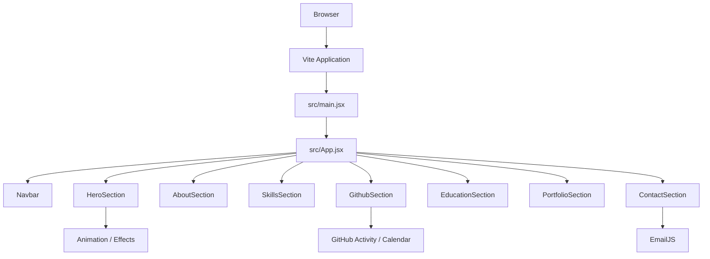

# Web Portfolio

Portfolio website built with React and Vite to present personal information, technical skills, GitHub activity, education, selected projects, and contact information in a single-page experience.

Repository: `kktpx/Web-Portfolio`

---

## Overview

This project is a component-based personal portfolio website. The page is composed from independent React sections such as the hero, about, skills, GitHub activity, education, portfolio, and contact sections.

The current project uses React 19 with Vite as the development/build tool. EmailJS is used for client-side contact form delivery, while GSAP and custom UI components are available for motion and interactive presentation.

## Features

- Responsive single-page portfolio
- Hero and introduction section
- About section
- Skills / technology section
- GitHub activity section
- Education section
- Project / portfolio showcase
- Contact section
- EmailJS integration for contact messages
- Animation and interactive UI support
- ESLint configuration for code quality

## Tech Stack

### Core

- React 19
- React DOM
- Vite 7
- JavaScript / JSX
- CSS

### UI and Interaction

- GSAP
- Lucide React
- React GitHub Calendar
- Custom reusable React components

### External Service

- EmailJS

### Development

- ESLint
- React Hooks ESLint plugin
- React Refresh
- Sharp

---

## Architecture

The application follows a simple component-oriented frontend architecture.



### Application Flow

1. `src/main.jsx` mounts the React application.
2. `src/App.jsx` acts as the page composition layer.
3. Each major portfolio section is separated into its own component directory.
4. Static and reusable content is kept under `src/data` and `src/assets`.
5. Contact form requests can be sent through EmailJS.
6. Vite bundles the application for production.

---

## Project Structure

```text
Web-Portfolio/
├── .env.example
├── .gitignore
├── eslint.config.js
├── index.html
├── package.json
├── package-lock.json
├── vite.config.js
├── public/
└── src/
    ├── App.jsx
    ├── App.css
    ├── main.jsx
    ├── index.css
    ├── assets/
    ├── data/
    └── components/
        ├── AboutSection/
        ├── ContactSection/
        ├── EducationSection/
        ├── ElectricBorder/
        ├── GithubSection/
        ├── HeroSection/
        ├── Navbar/
        ├── PortfolioSection/
        ├── SkillsSection/
        ├── TextType/
        └── common/
```

### Important Files

| File / Directory | Purpose |
|---|---|
| `src/main.jsx` | React application entry point |
| `src/App.jsx` | Composes all main portfolio sections |
| `src/components/` | Feature and UI components |
| `src/data/` | Portfolio data separated from UI logic |
| `src/assets/` | Local images and other assets |
| `public/` | Public static files |
| `.env.example` | Example EmailJS environment configuration |
| `vite.config.js` | Vite configuration |
| `eslint.config.js` | Code quality configuration |

---

## Prerequisites

Before installing the project, make sure you have:

- Node.js compatible with Vite 7
- npm
- Git
- An EmailJS account if you want the contact form to send real messages

Check your installed versions:

```bash
node --version
npm --version
git --version
```

---

## Installation

### 1. Clone the repository

```bash
git clone https://github.com/kktpx/Web-Portfolio.git
cd Web-Portfolio
```

### 2. Install dependencies

For a normal local setup:

```bash
npm install
```

For a reproducible installation based on `package-lock.json`:

```bash
npm ci
```

### 3. Configure environment variables

Copy the example file:

macOS / Linux:

```bash
cp .env.example .env
```

Windows PowerShell:

```powershell
Copy-Item .env.example .env
```

Then configure:

```env
VITE_EMAILJS_SERVICE_ID=your_service_id_here
VITE_EMAILJS_TEMPLATE_ID=your_template_id_here
VITE_EMAILJS_PUBLIC_KEY=your_public_key_here
```

Do not commit real service credentials into Git.

### 4. Start the development server

```bash
npm run dev
```

Open the local URL shown by Vite in your terminal.

---

## Available Scripts

| Command | Description |
|---|---|
| `npm run dev` | Start Vite development server |
| `npm run build` | Build optimized production files |
| `npm run preview` | Preview the production build locally |
| `npm run lint` | Run ESLint across the project |

Recommended verification before pushing changes:

```bash
npm run lint
npm run build
```

---

## Environment Variables

The current `.env.example` contains the EmailJS variables below.

| Variable | Description |
|---|---|
| `VITE_EMAILJS_SERVICE_ID` | EmailJS service identifier |
| `VITE_EMAILJS_TEMPLATE_ID` | EmailJS email template identifier |
| `VITE_EMAILJS_PUBLIC_KEY` | EmailJS public browser key |

Because Vite exposes variables prefixed with `VITE_` to client-side code, never store private server secrets in these variables.

---

## Component Architecture

The current component structure is section-oriented.

```text
App
├── Navbar
├── HeroSection
├── AboutSection
├── SkillsSection
├── GithubSection
├── EducationSection
├── PortfolioSection
└── ContactSection
```

This structure keeps the top-level application easy to understand and allows each section to maintain its own UI, styling, and interaction logic.

For future growth, reusable primitives should stay in `components/common`, while page-specific logic should remain inside the corresponding section folder.

---

## Production Build

Create a production build:

```bash
npm run build
```

Vite writes the generated site to:

```text
dist/
```

Preview it locally:

```bash
npm run preview
```

The `dist/` directory can be deployed to a static hosting provider such as Vercel, Netlify, Cloudflare Pages, GitHub Pages, or another static web host.

---

## Deployment Checklist

Before deploying:

- Run `npm run lint`
- Run `npm run build`
- Verify all images load correctly
- Verify responsive layouts on mobile and desktop
- Test navigation links
- Test the contact form
- Confirm EmailJS variables are configured in the hosting platform
- Confirm no private credentials are committed
- Test keyboard navigation
- Test reduced-motion behavior if animations are used
- Check production performance with browser DevTools or Lighthouse

---

## Performance Considerations

Portfolio websites often contain animation, large images, and decorative effects, so performance should be treated as part of the user experience.

Recommended practices:

- Compress large images and prefer WebP/AVIF where appropriate
- Lazy-load media below the fold
- Avoid running animation loops for invisible elements
- Stop or reduce animations when the page is hidden
- Respect `prefers-reduced-motion`
- Keep expensive blur/filter effects limited on low-powered devices
- Dynamically load heavy optional features where useful
- Preload only truly critical assets
- Measure changes using Lighthouse and the browser Performance panel

---

## Accessibility

Recommended baseline:

- Use semantic HTML
- Maintain logical heading order
- Provide useful `alt` text for meaningful images
- Ensure navigation is keyboard accessible
- Show visible focus indicators
- Maintain sufficient color contrast
- Avoid using animation as the only way to communicate information
- Respect `prefers-reduced-motion`
- Label form controls correctly
- Test with screen readers where possible

---

## Testing Recommendations

The repository currently focuses on frontend implementation. A stronger production workflow can add:

### Unit / Component Tests

Suggested tools:

- Vitest
- React Testing Library

Useful targets:

- Navigation behavior
- Portfolio rendering from data
- Contact form validation
- EmailJS request handling
- Interactive animation state
- Accessibility behavior

### End-to-End Tests

Suggested tool:

- Playwright

Useful flows:

1. Load home page
2. Navigate between sections
3. Open project links
4. Submit invalid contact form
5. Submit valid contact form with mocked EmailJS
6. Verify responsive navigation

---

## Recommended CI

A basic GitHub Actions pipeline should run:

```text
Install dependencies
        ↓
Lint
        ↓
Test
        ↓
Production build
```

Example commands:

```bash
npm ci
npm run lint
npm test
npm run build
```

Add the test step after a test script is introduced.

---

## Recommended Improvements

### High Priority

- Add automated tests
- Add CI workflow
- Add production deployment status
- Add screenshots / preview GIF
- Add live demo URL
- Verify accessibility with keyboard and screen reader testing
- Monitor animation performance on low-end devices

### Codebase

- Keep portfolio data separate from presentation components
- Convert repeated UI into shared components
- Add error handling around external integrations
- Add a dedicated configuration layer for public settings
- Document component-specific behavior where interaction is complex

### Repository

- Add a project license if public reuse is intended
- Add issue / pull request templates if collaboration is expected
- Add a `CONTRIBUTING.md` file for external contributors

---

## Troubleshooting

### Vite does not start

Remove installed dependencies and reinstall:

macOS / Linux:

```bash
rm -rf node_modules
npm ci
```

Windows PowerShell:

```powershell
Remove-Item -Recurse -Force node_modules
npm ci
```

### Contact form does not send

Check:

1. `.env` exists
2. All EmailJS values are correct
3. The EmailJS template matches the form variables
4. The browser console does not contain network or configuration errors
5. The development server was restarted after changing `.env`

### Production page is blank

Run:

```bash
npm run build
npm run preview
```

Then inspect browser console errors and verify deployment base-path configuration.

---

## Contributing

1. Fork the repository
2. Create a feature branch
3. Make focused changes
4. Run lint/build checks
5. Commit with a clear message
6. Open a pull request

Example:

```bash
git checkout -b feature/improve-project-section
npm run lint
npm run build
git add .
git commit -m "feat: improve project section"
git push origin feature/improve-project-section
```

---

## License

No project license is documented in this README. Add a `LICENSE` file if you want to clearly define reuse and distribution permissions.
